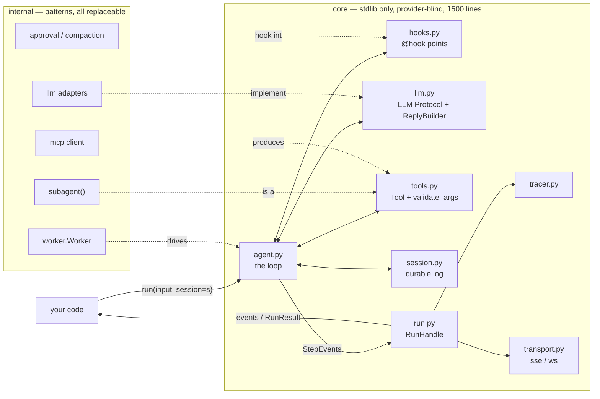

# stellar core

A complete agent harness heart in **1,500 lines you can read in an afternoon**. Durable sessions, long-lived agents, subagents, MCP, prompt caching, streaming, human-in-the-loop — the capabilities of a 15,000-line platform, at a tenth of the code, with every line yours to change. The core is stdlib-only; there is no framework underneath, only typed interfaces and a loop.

```
core/                 the heart — 1500 lines exactly, stdlib only, py.typed
├── types.py          Message, ToolCall, ToolResult, Usage, content Blocks
├── events.py         StepEvent = kind × phase, the single event shape
├── llm.py            LLM protocol + ReplyBuilder (the adapter skeleton)
├── tools.py          Tool, @tool, ToolCallContext, validate_args guardrail
├── hooks.py          @hook decorator — before/after llm + tool
├── session.py        durable append-only JSONL log, crash repair, resume
├── run.py            RunHandle: stream, replay, stop, steer; bounded buffers
├── tracer.py         Tracer protocol + Console/Jsonl tracers
├── transport.py      sse() / ws_frames() — pure serializers
└── agent.py          the loop (~370 lines) — everything else serves it

internal/             replaceable patterns built ON the core (not in the budget)
├── llm/              openai (chat + responses), anthropic (+ prompt caching),
│                     litellm (100+ providers, optional dep), moonshot,
│                     retry wrapper, structured extraction; common.py holds
│                     the 3-transformation adapter recipe
├── hooks/            approval (HITL permission gate), compaction (token-aware)
├── tools/schema.py   signature + docstring → JSON Schema
├── subagent.py       subagent() — spawn a child derived from the parent
├── worker.py         the long-lived agent: queue → turns → one durable session
└── mcp.py            MCP client (stdio + streamable HTTP) → core Tools

tests/                fake-LLM suites + hypothesis property tests, no pytest
examples/             8 offline-runnable examples (see examples/README.md)
examples/cc/          the flagship: Claude Code rebuilt on this core
```

## Architecture



Everything crossing a boundary speaks the `types.py` vocabulary — the narrow waist. Adapters translate provider wire formats to it; the loop never sees provider data.

## The loop

```
run/start                            (request derived from the session log)
repeat up to max_steps:
    drain steering inbox             handle.send() lands here
    before_llm hooks                 may rewrite messages/tools (compaction…)
    text/start → text/delta* → text/end
    after_llm hooks
    no tool calls? → break
    per tool call (parallel or sequential):
        tool/start
        validate_args guardrail      bad args → readable error, handler untouched
        before_tool hooks            may short-circuit (permission gate)
        execute handler              streams tool/delta* progress
        after_tool hooks             may replace/redact the result
        tool/end
run/end                              always emitted — completed | truncated |
                                     stopped | error
```

Every new message is appended through the session as it happens, so the durable transcript and the live one cannot diverge.

## Durable sessions — the reliability spine

The session is an append-only JSONL log and the **source of truth**: each run derives its request from it and appends through it. Stolen from the event-sourcing harnesses, at message granularity instead of token granularity — 95% of the value, 3% of the machinery.

```python
with Session("task.jsonl") as s:          # or Session.load() to continue
    await agent.run("do the thing", session=s)
```

* Kill the process at any point. `Session.load()` repairs the log — dangling tool calls get synthetic error results, torn tail writes are truncated — and the next run continues with full history.
* Compaction never rewrites the log: hooks shape the *request view*, the log keeps everything.
* Single-writer enforced by `flock`; corruption is loud, never silent.
* Property-tested: a transcript cut at **any byte** loads back to an exact prefix with no dangling calls (`tests/test_properties.py`).

Try it on the Claude Code replica:

```
uv run python -m examples.cc.cc --session 7b2f "refactor the parser"
^C  (or kill -9 it)
uv run python -m examples.cc.cc --session 7b2f "continue"   # picks up where it died
```

## The extension seams

**LLM adapter** — implement one method; `ReplyBuilder` is the skeleton that makes it hard to get wrong:

```python
class MyLLM:
    async def stream(self, messages, tools, **params):
        b = ReplyBuilder()
        async for ev in provider_stream(...):
            if ev.is_text:        yield b.text(ev.chunk)
            elif ev.is_thinking:  yield b.reasoning(ev.chunk)
            elif ev.opens_call:   b.tool_call(ev.index, id=ev.id, name=ev.name)
            elif ev.is_args:      yield b.tool_args(ev.index, ev.fragment)
        yield b.reply()
```

The builder owns assembly: text joins in order, tool-call fragments accumulate per index, truncated argument JSON becomes a flagged call that the loop turns into a readable "re-issue the call" error for the model — never a silent drop, never a handler crash. See `internal/llm/anthropic.py` (~320 lines including its self-check, with prompt caching).

**Tools** — a JSON Schema and a function; the context streams progress and reaches the run:

```python
@tool(parameters={"type": "object",
                  "properties": {"city": {"type": "string"}},
                  "required": ["city"]})
async def weather(ctx, city: str):
    "Get weather for a city."
    await ctx.emit_delta({"progress": f"fetching {city}"})
    return {"city": city, "temp_c": 31}
```

Arguments are validated against the schema before dispatch (`Tool.validate`, on by default) — whatever the model or adapter produces, your handler only ever sees kwargs that fit its signature. Prefer inferred schemas? `internal/tools/schema.py` builds them from the signature + docstring.

**Hooks** — a decorated function taking its context; attach as a flat list:

```python
@hook("before_tool")
def gate(ctx):
    if ctx.call.name in BLOCKED:
        ctx.result = ToolResult(ctx.call.id, ctx.call.name, "denied", is_error=True)

agent = Agent(llm, tools=[...], hooks=[
    gate,
    compaction(max_tokens=100_000),        # internal/hooks — token-aware, exact
    approval_gate(rules, asker=my_asker),  # HITL permission gate, full audit trail
])
```

`before_tool` setting `ctx.result` short-circuits execution — that one rule is your permission gate, HITL approval, cache hit, and dry-run mode. Hook failures abort the run (fail closed); tracer failures are swallowed (fail open); tool failures become error results the model can read (fail forward).

**Tracer** — `async on_event(event)`, every event in order. `JsonlTracer` is a replayable run record; point OTel, your DB, or a TUI at the same seam.

## Long-lived agents

```python
worker = Worker(agent, Session.load("agent.jsonl"))   # crash? load + continue
task = asyncio.create_task(worker.serve())            # idles on the queue for hours
worker.send("new task")          # its own turn
worker.steer("also check X")     # joins the active turn — never silently lost
worker.stop_turn()               # graceful, partial reply persisted
await worker.close()             # drains unrun inputs into the log, unanswered
```

## Subagents and MCP

```python
lead = Agent(llm, tools=[
    read, bash,
    subagent(name="researcher", description="Delegate a research task",
             system="Research deeply; report findings only."),
    *await mcp_tools(server),     # any MCP server's tools, validated like local ones
], hooks=[approval_gate(rules, asker)])
```

A subagent is just a tool that spawns a child **derived from the running parent**: same LLM (override with `llm=` for a cheaper child), same tools minus itself (`tools=` to narrow or re-enable recursion), and — critically — the same hooks, so the parent's permission gate guards the child's `bash` too. The child's entire event stream forwards through the parent handle (`tool/delta` events, nesting for grandchildren), stop propagates down, depth is guarded. `mcp.py` speaks stdio and streamable HTTP, survives 1MB tool results, dead servers fail loudly.

## Serving

`handle.events(after_seq=n)` replays the buffer then follows live — reconnects with `Last-Event-ID` just work:

```python
@app.post("/agent/run")
async def run(req: RunRequest):
    handle = agent.run(req.input, session=sessions[req.id])
    RUNS[handle.run_id] = handle
    return StreamingResponse(sse(handle.events()), media_type="text/event-stream")
```

Buffers are bounded (`RunHandle.max_buffer/max_queue`): a slow consumer sheds its oldest events, never `run/end` (holds for `max_queue >= 2`); hours-long runs don't grow memory without bound.

## Invariants (the reliability contract)

1. Every step emits `start` and `end` exactly once; `delta` zero or more in between.
2. Every run ends with exactly one `run/end` — completed, truncated, stopped, or error. Always.
3. `seq` is strictly increasing; it is the total order and the resume cursor.
4. `stop()` is graceful: partial text persisted (`meta.interrupted`), in-flight tools end `cancelled`, every event still reaches tracers and subscribers.
5. The request is derived from the session log; with a session attached, the durable and live transcripts cannot diverge.
6. Tool failures never crash the loop; hook failures abort it; tracer failures are invisible.
7. The loop only speaks `types.py`. Provider data inside `agent.py` is a bug.

## Event grammar

Three phases (`step_start` / `step_delta` / `step_end` on the wire) × four kinds:

| kind | start | delta | end |
|---|---|---|---|
| `run` | `messages`, `run_id` | — | `status`, `steps`, `usage`, `stop_reason`, `error` |
| `text` | `step` | `text`, `channel` (`text`\|`reasoning`\|`tool_args`), `index` | `text`, `tool_calls[]`, `stop_reason`, `partial`, `usage` |
| `tool` | `call_id`, `name`, `arguments` | `call_id` + tool-defined (subagents: `child`) | `call_id`, `name`, `result`, `is_error`, `error?` |
| `hook` | `point`, `hook` | — | `point`, `hook`, `error?` |

## Testing

```
uv run python tests/test_agent.py        # loop, sessions, subagents — fake LLM
uv run python tests/test_session.py      # round-trip, repair, corruption
uv run python tests/test_properties.py   # hypothesis: crash-cut recovery & more
uv run python -m internal.llm.anthropic  # every internal module self-checks
uv run python -m examples.cc.cc selfcheck
```

## Deliberate non-features

No DI container, no plugin system, no phase machine, no delta-level persistence, no code-mode, no SDK codegen, no retry policy in the loop (wrap the adapter: `internal/llm/retry.py`). Multimodal input is typed blocks (`text_block` / `image_block` / `file_block`) — PDFs included, translated per provider. Everything else is an adapter, a hook, a tracer, or a tool you write on top: the seams are there, the opinions are not.
