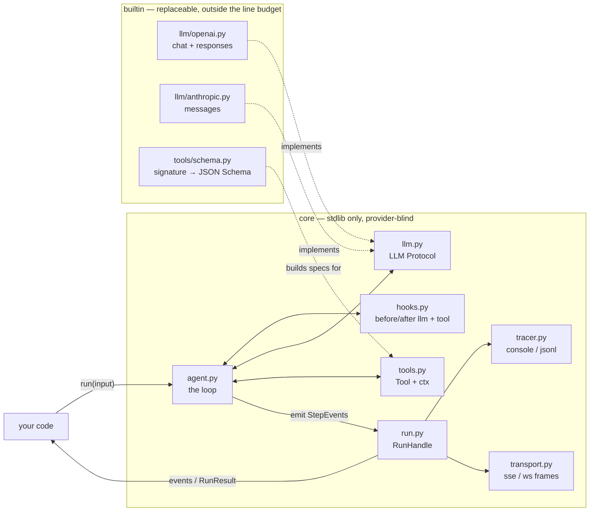

# core

A minimal, hackable agent heart. Three layers, one event grammar, one handle. Zero dependencies (stdlib only), ~1000 lines. Designed to be vendored as a git submodule into any project and adapted with full control — there is no framework underneath, only interfaces and a loop.

```
core/
├── types.py       Message, ToolCall, ToolResult, Usage — the generic vocabulary
├── events.py      StepEvent = kind × phase, the single event shape
├── llm.py         LLM protocol: "deltas, then exactly one reply"
├── tools.py       ToolSpec, Tool, @tool, ToolCallContext (progress deltas)
├── hooks.py       before_llm / after_llm / before_tool / after_tool
├── tracer.py      Tracer protocol + Console/Jsonl tracers
├── run.py         RunContext, RunResult, RunHandle (stream, stop, replay)
├── transport.py   sse() and ws_frames() — pure serializers
└── agent.py       the loop (~200 lines) — the whole heart
```

## Architecture



Everything crossing a boundary speaks the `types.py` vocabulary (`Message`, `ToolCall`, `ToolResult`, `Usage`, `ErrorInfo`) — the narrow waist. Adapters translate provider wire formats to it; the loop never sees provider data.

## The loop

```
run/start
repeat up to max_steps:
    before_llm hooks              each hook = hook/start..hook/end
    text/start → text/delta* → text/end
    after_llm hooks
    no tool calls? → break
    per tool call (sequential, or parallel_tools=True):
        tool/start
        before_tool hooks         may short-circuit by setting ctx.result
        execute handler           may emit tool/delta* progress
        after_tool hooks          may replace/redact ctx.result
        tool/end
run/end
```

## Event grammar

Three phases (`step_start`, `step_delta`, `step_end` on the wire) × four kinds. `seq` is a per-run monotonic counter: the total order of the run and the resume cursor.

| kind | start payload | delta payload | end payload |
|---|---|---|---|
| `run` | `messages`, `run_id` | — | `status`, `steps`, `usage`, `stop_reason`, `error` |
| `text` | `index` | `text` | `text`, `tool_calls[]`, `stop_reason`, `partial`, `usage` |
| `tool` | `call_id`, `name`, `arguments` | `call_id` + whatever the tool emits | `call_id`, `name`, `result`, `is_error` |
| `hook` | `point`, `hook` | — | `point`, `hook`, `error?` |

## Invariants (the reliability contract)

1. Every step emits `start` and `end` exactly once; `delta` zero or more times in between.
2. Every run ends with exactly one `run/end` — completed, stopped, or error. Always. Consumers can key teardown off it.
3. `seq` is strictly increasing with no gaps within a run.
4. `stop()` is graceful: current chunk finishes, `text/end` carries `partial: true`, in-flight tools end as `is_error: "cancelled"`, then `run/end` with `status: "stopped"`. Every event is still delivered to tracers and subscribers.
5. Tool failures never crash the loop — they become `ToolResult(is_error=True)` in the transcript so the LLM can see and recover.
6. Hook failures ABORT the run (fail closed). A guardrail that breaks must not fail silently. Wrap best-effort hooks in try/except yourself.
7. Tracer failures are swallowed (fail open). Observability never takes down execution.
8. The loop only ever touches generic types from `types.py`. If provider data leaks into `agent.py`, that's a bug.

## The three extension seams

**LLM adapter** — anything with `stream(messages, tools, **params)` yielding `LLMDelta*` then exactly one `LLMReply`. All provider mess (partial tool-call JSON accumulation, retries, stop-reason mapping) lives inside your adapter. See `builtin/llm/openai.py` for the shape (raw httpx + SSE, no SDK — `base_url` points it at any OpenAI-compatible server); an Anthropic adapter is the same ~100 lines.

**Hooks** — mutate their context in place. `before_llm`/`after_llm` edit `messages`/`tools`/`reply` (context compaction, PII scrub, prompt injection defense). `before_tool` edits `call.arguments` or sets `ctx.result` to short-circuit — that one rule is your permission gate, HITL approval, cache hit, and dry-run mode. `after_tool` rewrites `ctx.result` (redaction, truncation, verification).

**Tracer** — `async on_event(event)`, receives every event in order. `JsonlTracer` gives you a replayable run record for free; point an OTel exporter, your DB, or a golden-output recorder at the same seam.

## Usage

```python
from core import Agent, Hooks, tool, ToolResult, JsonlTracer

@tool(parameters={"type": "object",
                  "properties": {"city": {"type": "string"}},
                  "required": ["city"]})
async def weather(ctx, city: str):
    "Get weather for a city."
    await ctx.emit_delta({"progress": f"fetching {city}"})
    return {"city": city, "temp_c": 31}

hooks = Hooks()

@hooks.on("before_tool")
def gate(ctx):
    if ctx.call.name in BLOCKED:
        ctx.result = ToolResult(ctx.call.id, ctx.call.name,
                                "denied", is_error=True)

agent = Agent(MyLLM(), tools=[weather], hooks=hooks,
              tracers=[JsonlTracer("runs.jsonl")],
              system="Be brief.", max_steps=8)

handle = agent.run("weather in Hisar?", history=prior_messages)
async for event in handle:            # live stream
    ...
result = await handle.result()        # RunResult(status, messages, output, usage)
```

Serving over SSE (FastAPI) — `handle.events(after_seq=n)` replays the buffer then follows live, so reconnects with `Last-Event-ID` just work:

```python
@app.post("/agent/run")
async def run(req: RunRequest):
    handle = agent.run(req.input, history=load_history(req.session_id))
    RUNS[handle.run_id] = handle       # keep for /stop and reconnect
    return StreamingResponse(sse(handle.events()),
                             media_type="text/event-stream")

@app.post("/agent/{run_id}/stop")
async def stop(run_id: str):
    RUNS[run_id].stop("user")
    return {"ok": True}

@app.websocket("/agent/{run_id}/ws")
async def ws(websocket, run_id: str, cursor: int = -1):
    await websocket.accept()
    async for frame in ws_frames(RUNS[run_id].events(after_seq=cursor)):
        await websocket.send_text(frame)
```

## Deliberate non-features

No provider clients, no retry policy, no memory, no MCP, no sub-agents, no persistence, no permission UI. Each of those is an adapter, a hook, a tracer, or a tool you write on top — the seams are there, the opinions are not. (Sub-agents, for instance: a tool whose handler does `await other_agent.run(...)`, forwarding its events through `ctx.emit_delta`.)

## Notes

- `Agent.run()` must be called inside a running asyncio event loop (it spawns a task). The handle is awaitable: `result = await agent.run(...)`; keep it un-awaited to stream events.
- The in-memory event buffer is the replay source; the tracer is the durable record. Cap or offload the buffer if you run unbounded generations.
- `hooks` also accepts a plain mapping: `Agent(llm, hooks={"before_tool": [gate]})`.
- Parallel tool calls: `Agent(..., parallel_tools=True)` — events interleave, keyed by `call_id`; transcript order stays deterministic.
