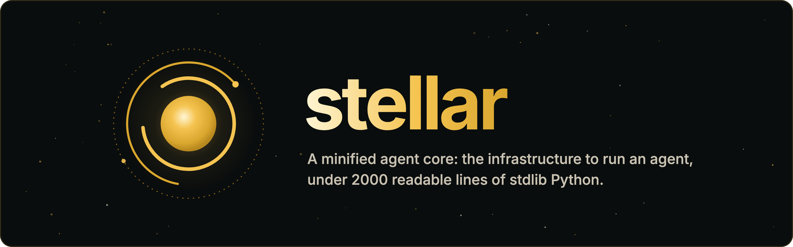

<p align="center">
  
</p>

<p align="center">
  <a href="LICENSE"></a>
  <a href="pyproject.toml"></a>
</p>

A minified agent core: the infrastructure to run an agent, kept under 2000
readable lines (`wc -l core/*.py`) and built on the standard library alone.
Small enough to read top to bottom in one sitting, strong enough for hard tasks
when it is used well. Everything past the loop — providers, rule cards,
transports — is a small file outside `core/` that you can read, copy and change.

This file is the short version. The long one is the docs site under
[`docs/`](docs/README.md); every section below links to its pages.

## Quickstart

```python
import asyncio

from core import Agent, tool
from hooks.steps import Steps
from models.anthropic import Anthropic


@tool
def shout(word: str) -> str:
    """Shout a word."""
    return word.upper()


agent = Agent(Anthropic("claude-sonnet-5"), [shout])
agent.hooks.attach(Steps(8))                       # a runaway cap, on every run


async def main() -> None:
    run = await agent.run("shout hello")
    print(run.messages[-1].text)                   # what the model said last


asyncio.run(main())
```

`uv sync`, export `ANTHROPIC_API_KEY`, run it. Build the agent once and call
`run()` per conversation; `run.messages` is the whole conversation. With no
key at hand, `FakeModel` plays the model.

Docs: [introduction](docs/content/introduction.mdx),
[quickstart](docs/content/quickstart.mdx),
[your first agent](docs/content/examples/hello.mdx).

## The loop

An agent is a robot with one backpack: a brain (`model`), a toolbox (`tools`),
a stack of rule cards (`hooks`), a radio (`events`) and one spare pocket
(`extra`). One errand is one `Run`, with its own notebook (`messages`), step
count and id.

```
run.pre
  ┌ model.pre → the model answers, a model.delta per streamed Part → model.post
  │   the answer goes in the notebook; for each tool it asked for:
  │     tool.pre → the tool runs, a tool.delta per yielded Part → tool.post
  │     → the result goes in the notebook
  └ again, as long as the last answer asked for tools
run.post
```

Those eight stages are the only moments there are: hooks bind to them, the bus
records them. One `Agent`, as many `Run`s as you like — a hundred users is one
`asyncio.gather`, and nothing of one run leaks into another. Any part swaps by
assignment, even mid-run: `check()` reads the whole backpack again at the top
of every step.

Docs: [the agent loop](docs/content/concepts/loop.mdx),
[Agent and Run](docs/content/concepts/agent-and-run.mdx),
[concurrent runs](docs/content/patterns/concurrency.mdx).

## The twelve nouns

Three pieces of data: `Part`, `ToolCall`, `Message`. Two contracts: `Model`
(async `invoke(run)`, hand back a `Message`) and `Tool` (async
`execute(run, …)`; an async generator streams). Two planes: `Hooks` and
`Event`/`Events`. The bag and the errand: `Agent` and `Run`. Two signals:
`ContractError` (you wired it wrong; the message carries the code to type
instead) and `Stop` (end the run cleanly, from any hook or tool). Nothing else
gets to be a noun.

Docs: [core primitives](docs/content/concepts/nouns.mdx),
[contracts](docs/content/concepts/contracts.mdx),
[control flow](docs/content/concepts/control.mdx),
[reference](docs/content/reference/types.mdx).

## What ships

| | | docs |
| --- | --- | --- |
| `models/` | `Anthropic` (the Messages API), `OpenAI` (Chat Completions, the wire the compatible vendors clone) and `Responses` (the Responses API, reasoning kept). A provider is a folder: `mapping.py` is the table, `model.py` the rest. `Fallback` composes Models across providers. | [models](docs/content/models/overview.mdx), [custom providers](docs/content/models/provider.mdx), [provider internals](docs/content/models/folder.mdx), [profiles](docs/content/models/profiles.mdx), [fallback](docs/content/models/fallback.mdx), [testing](docs/content/models/testing.mdx) |
| tools | `@tool` turns a function into a tool: name, docstring, signature. A `Tool` class when it holds something. `parallel=True` lets calls ride together; a serial tool is a barrier. | [functions](docs/content/tools/functions.mdx), [classes](docs/content/tools/classes.mdx), [parallel](docs/content/tools/parallel.mdx), [results](docs/content/tools/results.mdx) |
| `hooks/` | `@hook("tool.pre")` tags an async function; what it returns replaces the payload. Seven shipped cards: `Steps`, `Budget`, `Permission`, `Log`, `Output` (structured replies, re-asked in place), `Compact` (summarise a long notebook), `Truncate` (cap a tool result). | [hooks](docs/content/hooks/overview.mdx), [stages](docs/content/hooks/stages.mdx), [stopping](docs/content/hooks/stopping.mdx), [cards](docs/content/hooks/cards.mdx); the last three cards are in [`hooks/`](hooks/) until their pages land |
| `drivers/` | The bus keeps every event, replays from a cursor, then goes live; `sse()` and `ws_frames()` frame one run's stream for a browser. stellar ships no server. | [events](docs/content/events/overview.mdx), [streaming](docs/content/events/streaming.mdx), [transport](docs/content/events/transport.mdx) |
| patterns | A sub-agent is a tool. A checkpoint is the `Run`, four fields and no wiring. | [sub-agents](docs/content/patterns/sub-agents.mdx), [checkpoint and resume](docs/content/patterns/checkpoint.mdx), [examples](docs/content/examples/hello.mdx) |

## Harness-Bench

[Harness-Bench](https://github.com/Qihoo360/harness-bench)
([paper](https://arxiv.org/abs/2605.27922)) is 106 offline tasks — files,
shell, browser, office documents, code repair, multi-round sessions — each
scored as outcome × process × security, the last two by an LLM judge reading
the agent's trace.

stellar runs it through the bench's `generic_cli` adapter: one script that
builds an `Agent` on `core` and changes nothing in it. Five tools (`bash`,
`read_file`, `write_file`, `edit_file`, `view_image`), a `Steps` cap, a
`Budget`, a `Log` on the bus, and a system prompt that asks for a checklist
first and a check at the end. The model is gpt-5.6-luna over the Responses
API at reasoning effort high.

| harness | model | completion | process | combined |
| --- | --- | ---: | ---: | ---: |
| **stellar** | gpt-5.6-luna | 85.5 | 97.4 | **83.3** |
| nanobot | gpt-5.4 | | | 81.3 |
| codex | gpt-5.4 | | | 80.4 |
| nanobot | average over models | | | 76.2 |
| hermes | average | | | 71.2 |
| moltis | average | | | 68.8 |
| nullclaw | average | | | 64.4 |
| zeroclaw | average | | | 61.4 |
| openclaw | average | | | 52.4 |

The stellar row is one full pass on 2026-09-11: all 106 tasks, twelve at a
time, 17 minutes of wall clock, about $2.40 of tokens at list price. The other
rows are the public leaderboard at harness-bench.ai as read on 2026-09-10.

Read it with care. The leaderboard rows ran other models and were graded by
their own judge; ours was judged by gpt-5.6-luna, with `temperature` left out
of the judge call because gpt-5.x rejects it — a plumbing fix, not a scoring
one. Six full passes over two days landed between 80.1 and 83.3 combined,
the first one aside (69.1, twenty runs lost to rate limits). The same task
can swing ten points and more between passes; the mean is steady to about a
point.

## Layout

```
core/       the twelve nouns and the loop — stdlib (bar llm.py), under 2000 lines
models/     one folder per provider: anthropic/, openai/, responses/
hooks/      steps, budget, permission, logging, output, compact, truncate
drivers/    transport.py — sse() and ws_frames() over events.stream()
tests/      plain python files, assert-based, no pytest
docs/       the site: docs.json is the table, content/ the pages
```

Imports are flat and one-way: `from core import Agent`,
`from models.anthropic import Anthropic`, `from hooks.steps import Steps`.
`models/`, `hooks/` and `drivers/` speak `core` and the standard library and
never each other.

Docs: [project layout](docs/content/layout.mdx).

## Tests and rules

```
for f in tests/test_*.py; do uv run python "$f" || exit 1; done
uv run ruff check .
```

Every test file is an ordinary Python script. `tests/test_rules.py` fails the
build on four rules:

- `core/*.py` is 2000 lines all together, at most.
- `core/` imports the standard library and itself, nothing else — plus httpx,
  in `llm.py` and nowhere else.
- `core/` never says a product or protocol name.
- `models/`, `hooks/` and `drivers/` import only `core` and the standard
  library — and a provider's own files, one dot deep.

Two more belong to whoever reviews the change: twelve nouns, and `Agent` has
one method, `run()`.

## The docs

`cd docs && npm install && npm run dev` serves the site; `npm run build`
writes it; `python3 docs/check.py` holds every page to the table and every
python fence to the parser. [`docs/README.md`](docs/README.md) says how to add
a page.

## License

MIT — see [LICENSE](LICENSE).
