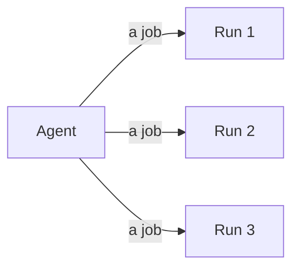

An `Agent` is the wiring: a model, some tools, some rules. A `Run` is one job.
You build the first once and start as many of the second as you like.



## Agent fields

- `model` is the brain. Every run of this agent asks this one.
- `tools` is the toolbox. Hand in a list and each tool is filed under its name.
- `hooks` are the rules every run of this agent inherits.
- `events` is the log. One per agent, and every run writes to it.
- `extra` is a spare pocket. Use namespaced keys, like `extra["ui.ask"]`.

Only `model` is required. Building the agent checks the wiring. A mistake
shows up on the line that built it, not on the first turn. And there is one
method, `run()`. There is never a second one.

## Run fields

- `agent` is the agent behind this run.
- `id` is a hex string, fresh each run, or the one you passed to `run_id=`.
- `messages` is the conversation, in order. The loop adds to it.
- `step` is how many turns the model has taken.
- `hooks` are this run's own rules, on top of the agent's.
- `extra` is a spare pocket for this run alone.

`run.hooks.attach(rule)` adds a rule nobody else in the process can see, and it
goes away when the run ends. Pickle a `Run` and you keep `id`, `messages`,
`step` and `extra`. The wiring is code, so you build that again. See
[save and continue](/patterns/checkpoint).

## One agent, many runs

```python run
import asyncio

from core import Agent, FakeModel

agent = Agent(FakeModel(["Paris.", "Tokyo.", "Lima."]))


async def main() -> None:
    jobs = [agent.run(question) for question in
            ["Capital of France?", "Capital of Japan?", "Capital of Peru?"]]
    for run in await asyncio.gather(*jobs):
        print(run.messages[0].text, run.messages[-1].text)


asyncio.run(main())
```

```text output
Capital of France? Paris.
Capital of Japan? Tokyo.
Capital of Peru? Lima.
```

A hundred users is that same line. Nothing leaks between them, because each
`Run` has its own conversation, step count, id, pocket and rules. Sharing the
agent is the point. One listener on `agent.events` hears all hundred, and
every event says which run it came from.

## Hot-swapping components

```python
agent.model = OpenAI("gpt-5.6-luna")
agent.tools = {"shout": shout}
```

There is no `configure()`, because composition is assignment. The next turn
picks up the change, because `check()` reads the whole agent again at the top
of every turn. Replacing `agent.hooks` will not reach a run already going, so
add and remove rules with `attach` and `detach`.
