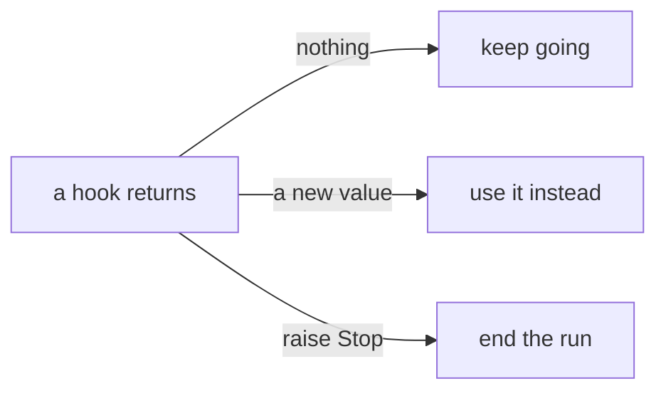

There are exactly two ways to steer the loop from outside it. One is raised,
one is returned. Everything else is either an answer the model reads or an
error you catch.



## Stop: end the run

Raise `Stop` from any hook or any tool. The loop catches it and ends the run
cleanly. No error reaches your `await`, and the `Run` comes back holding
everything written down so far.

```python run
import asyncio

from core import Agent, FakeModel, Message, Stop, ToolCall, hook, tool


@tool
def clock() -> str:
    """Tell the time."""
    return "12:00"


@hook("model.pre")
async def two_turns(messages: list, run) -> None:
    """The model gets two turns. Then the run ends."""
    if run.step > 2:
        raise Stop


asked = [Message("assistant", tool_calls=[ToolCall("1", "clock", {})])
         for _ in range(2)]
agent = Agent(FakeModel(asked), [clock])
agent.hooks.attach(two_turns)

run = asyncio.run(agent.run("what time is it?"))
for message in run.messages:
    print(message.role)
```

```text output
user
assistant
tool
assistant
tool
```

- The hook runs at the top of every turn, before the model is asked.
- Two turns went through. The third was stopped before it started.
- `Steps(2)` is this hook, already written for you. `Budget(max_tokens)` counts
  tokens the same way.

`run.post` always runs, after a clean finish, after a `Stop` and after a crash.
A `Stop` raised inside a `run.post` hook is ignored, because there is nothing
left to stop.

<Warning>
  A `Stop` in the middle of a stage skips whatever that stage had not done yet.
  Stop at `model.post` and the reply is never written into the conversation.
  `Budget` writes the reply down itself first, for exactly that reason.
</Warning>

## tool.pre: deny or replace a tool call

The second signal is returned, not raised. A `tool.pre` hook that returns
something has answered for the tool, and the tool never runs.

```python run
import asyncio

from core import Agent, FakeModel, Message, ToolCall, hook, tool


@tool
def rm(path: str) -> str:
    """Delete a file."""
    return f"deleted {path}"


@hook("tool.pre")
async def guard(call: ToolCall):
    """Never let the agent delete a file."""
    if call.name == "rm":
        return "denied: ask a human first"


agent = Agent(FakeModel([
    Message("assistant", tool_calls=[ToolCall("1", "rm", {"path": "notes.txt"})]),
    "I was not allowed to delete it.",
]), [rm])
agent.hooks.attach(guard)

run = asyncio.run(agent.run("delete notes.txt"))
print(run.messages[2].text)          # what the model was told the tool said
print(run.messages[-1].text)         # what the model said next
```

```text output
denied: ask a human first
I was not allowed to delete it.
```

| you return | what the loop does |
| --- | --- |
| `None` | nothing, the call goes through as it is |
| a `ToolCall` | runs that one instead, with a new name or better arguments |
| a `str` | skips the tool, and this is its result |
| a `Message` | the same, for a result that needs more than text |

The first rule that answers wins, and the rules behind it never hear that
stage. `Permission(deny, allow, ask)` is this signal in a uniform, and it
refuses with plain strings like `denied: rm`.

## Errors are not signals

- **A tool that raises.** The loop catches it, writes
  `error: ValueError: nope` into the conversation, and the model gets another
  turn.
- **A tool that is not in the toolbox.** The model reads
  `error: unknown tool: ghost` and tries again.
- **A `ContractError`.** That is a bug in your wiring. No model can fix it by
  trying again, so it comes straight out of your `await`.
