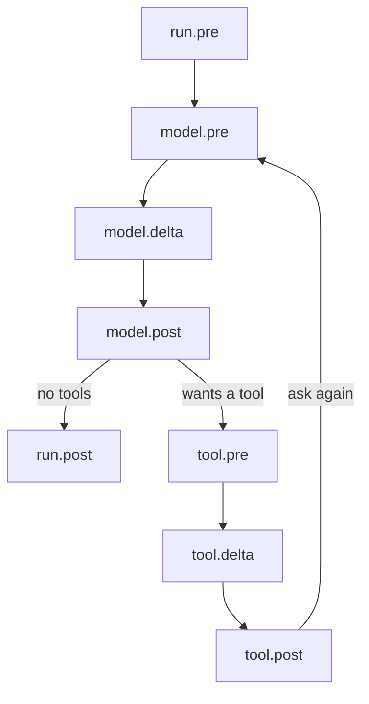

Here is the whole loop. Ask the model. Run the tools it asked for. Ask again.
It ends when the model stops asking for tools.



Each name is two things at once. Your rules ([hooks](/hooks/overview)) run
there first, and the loop waits for them. Then an event goes out with whatever
they agreed on. A hook can change things. A [listener](/events/overview) can
only watch.

## run.pre

Runs once, before the first turn. A hook here gets your prompt, and what it
returns takes the prompt's place.

## model.pre

The top of every turn. The wiring is checked again, `run.step` goes up by one,
then your hooks run. A hook here gets the whole conversation, and a list it
returns replaces it for good.

## model.delta

The model answers. Every model in the box sends its reply in pieces. Each
piece stops here, where a hook can swap it. A model with its own `invoke`
never reaches this one.

## model.post

The pieces are now one message. A hook here sees the answer before the
conversation does, and what it returns is what gets written down.

## tool.pre

Skipped when the answer asked for no tools. A hook here gets one tool call.
Return another call and that one runs. Return a string or a message and the
tool is skipped, and your answer becomes its result.

## tool.delta

The tools run. A tool written as an async generator sends its result in
pieces, and each piece stops here. The event names the tool it came from.

## tool.post

Whatever the tool gave back is now one message. A hook here can replace it.
Then it lands in the conversation in call order, whichever tool finished
first.

## run.post

The end, and it always happens: after a clean finish, after a `Stop`, after a
crash. A hook here gets the last message, and what it returns is ignored.

## How it ends

- **The model asked for no tools.** The ordinary ending.
- **A hook or a tool raised `Stop`.** No error reaches you, and the `Run` holds
  everything written down so far.
- **Something else raised.** It comes out of your `await`, with `run.post`
  already done.

## Watch it go round

Every name is also an event, so a listener can print them as they happen.

```python run
import asyncio

from core import Agent, FakeModel, Message, Part, ToolCall, tool


@tool
async def shout(word: str):
    """Shout a word, one piece at a time."""
    yield Part("text", word.upper())


def show(event) -> None:
    print(event.name)


agent = Agent(FakeModel([
    Message("assistant", tool_calls=[ToolCall("1", "shout", {"word": "hi"})]),
    "Done.",
]), [shout])
agent.events.listen(show)

asyncio.run(agent.run("shout hi"))
```

```text output
run.pre
model.pre
model.delta
model.post
tool.pre
tool.delta
tool.post
model.pre
model.delta
model.post
run.post
```

- The first answer asked for a tool, so the three `tool` names fire.
- Then the loop goes back to `model.pre` and asks again.
- The second answer asked for nothing, so the run ends.

<CardGroup cols={2}>
  <Card title="Stopping and skipping" icon="circle-slash" href="/concepts/control">
    The two ways to steer the loop from outside it.
  </Card>
  <Card title="Stages" icon="workflow" href="/hooks/stages">
    What each of the eight hands to your hook, in one table.
  </Card>
</CardGroup>
