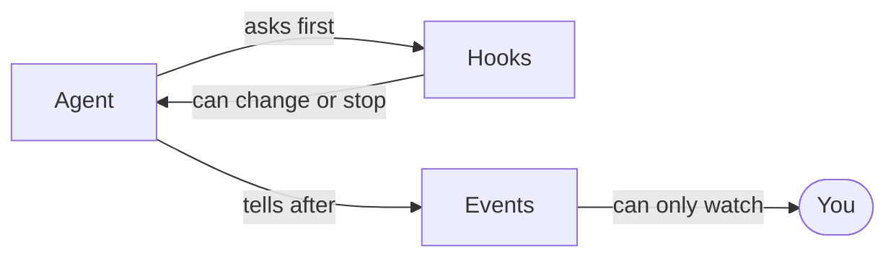

Every time your agent does something, it writes an event. The events are the
agent's diary. You can read them as they happen, or read them later.



The rules ([hooks](/hooks/overview)) get asked before something happens, and
they can change it. Events are told after, and they change nothing.

## What an event is

| field | what it is |
| --- | --- |
| `seq` | a number, counting up from 0. It is also the bookmark a reader comes back to. |
| `name` | what happened, like `run.pre` or `tool.post`. |
| `data` | whatever came with it, usually a [`Message`, `Part` or `ToolCall`](/reference/types). |
| `source` | who said it: `"loop"`, a tool's name, a model's, or yours. |
| `run_id` | which job it belongs to, or `None` if it belongs to no job. |
| `ts` | the time it happened. |

## Listen

Give `listen` a function that takes one event. It gets called every time an
event lands. Listeners are plain functions, never `async def`, because writing
an event never waits for anything.

```python run
import asyncio

from core import Agent, FakeModel

agent = Agent(FakeModel(["Hi there!"]))
agent.events.listen(lambda event: print(event.seq, event.name))
asyncio.run(agent.run("hello", run_id="a"))
```

```text output
0 run.pre
1 model.pre
2 model.delta
3 model.post
4 run.post
```

- `agent.events.log` is that whole list, oldest first, across every job.
- `agent.events.detach(fn)` stops telling it anything.
- If your listener raises, the error goes to the `core.events` logger and the
  next listener still hears the event.

## Hear less

`agent.events.listen(fn, "tool")` hears `tool.pre`, `tool.delta` and
`tool.post`, and nothing else. A name is cut at the dot, so `"tool"` never
hears `toolbox.x`. `agent.events.listen(fn, run_id=run.id)` hears one job.

## What the agent writes

| name | what came with it |
| --- | --- |
| `run.pre` | the message the job starts on |
| `model.pre` | a copy of the messages about to be sent |
| `model.delta` | one piece of the reply, as it arrives |
| `model.post` | the model's whole answer |
| `tool.pre` | the tool call about to run |
| `tool.delta` | one piece from a tool that streams, under that tool's name |
| `tool.post` | what the tool sent back |
| `run.post` | the last message. Streams end here. |

Each one is written after its hooks have run, so you see what they agreed on.

## Write your own

`run.emit("cache.hit", key)` puts your own event on the same list, stamped
with that job's id. Nothing checks the name, so your names count for as much
as the eight above.

## Good to know

- `model.pre` carries a copy of the messages. The conversation keeps growing,
  and the event log must not grow with it.
- Two more names come from outside the loop. [`Fallback`](/models/fallback)
  writes `model.skip` when it gives up on one model and asks the next. A model
  whose [profile](/models/profiles) streams tool arguments writes `tool.args`.
- For one readable line per event, [`Log`](/hooks/cards) is a listener you can
  hand straight to `listen`.

<CardGroup cols={2}>
  <Card title="As they happen" icon="radio-tower" href="/events/streaming">
    Read one job's events live, from anywhere in your code.
  </Card>
  <Card title="To a browser" icon="cable" href="/events/transport">
    Turn events into lines a web page can read.
  </Card>
</CardGroup>
