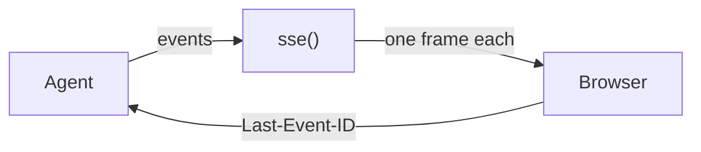

A web page cannot reach into your agent. It can hold a connection open and
read lines. `drivers/transport.py` turns [events](/events/streaming) into
those lines.



Both take any stream of events and give back strings. They add nothing else.

## Frame format

`sse()` writes three lines per event. First an `id:` line with the number.
Then a `data:` line with the whole event as JSON. Then a blank line. Browsers
already know this format.

```text
id: 4
data: {"seq": 4, "name": "tool.pre", "data": {"id": "c1", "name": "shout", "args": {"word": "hi"}}, "source": "loop", "run_id": "a", "ts": 1789045332.478462}
```

The event's name is inside the JSON, not in the frame. So every frame arrives
as a plain `message` and the page needs one handler, not one per stage.

`ws_frames()` writes the same JSON with no wrapping at all. One event, one
websocket frame.

## Example

```python run
import asyncio
import json

from core import Agent, FakeModel
from drivers.transport import sse


async def main() -> None:
    agent = Agent(FakeModel(["Hello!"]))
    job = asyncio.create_task(agent.run("hi", run_id="a"))
    async for frame in sse(agent.events.stream(run_id="a")):
        first, second = frame.strip().split("\n")
        print(first, json.loads(second.removeprefix("data: "))["name"])
    await job


asyncio.run(main())
```

```text output
id: 0 run.pre
id: 1 model.pre
id: 2 model.delta
id: 3 model.post
id: 4 run.post
```

## Reconnecting with Last-Event-ID

The browser remembers the last `id:` it saw and sends it back as a
`Last-Event-ID` header when it reconnects. Start the stream one past that
number and the page misses nothing.

```python
last = request.headers.get("Last-Event-ID")
events = agent.events.stream(run_id=rid, since=int(last) + 1 if last else 0)
```

## Serving with a web framework

<Note>
  stellar ships no server. `sse()` and `ws_frames()` hand you strings, and any
  web framework, or none, can carry them. The sketch below is one framework's
  spelling, not something core imports.
</Note>

```python nocheck
rid = uuid4().hex
task = asyncio.create_task(agent.run(ask, run_id=rid))
running.add(task)                          # hold it, or it can be collected
task.add_done_callback(running.discard)
return StreamingResponse(sse(agent.events.stream(run_id=rid)),
                         media_type="text/event-stream")
```

Starting the job and reading it are two separate things. The task is where the
`Run` and any error end up, and keeping hold of it is your job. The stream
needs nothing from it, and ends on `run.post` either way.

## Notes

- Each event is copied into JSON when the frame is written. What goes out is a
  snapshot, not a live handle on the conversation.
- `seq` counts per agent, not per job. One agent serving many people has
  numbers that climb past what any one reader sees. That is right for a
  bookmark and wrong for a progress bar.
