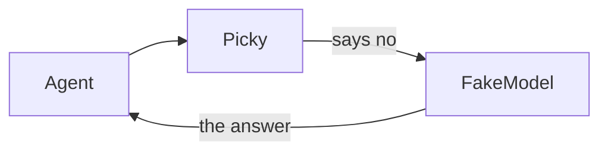

You will put two models in a row. If the first one cannot take the job, the
second one gets it.



```python run
import asyncio

from core import Agent, Fallback, FakeModel, Message, Model, Unsupported


class Picky(Model):
    """A model that says no before it sends anything."""

    async def invoke(self, run) -> Message:
        raise Unsupported("Picky reads no pictures")


agent = Agent(Fallback(Picky(), FakeModel(["The second model answered."])))
agent.events.listen(lambda e: print("skipped", e.source, "-", e.data), "model.skip")

run = asyncio.run(agent.run("hello"))

print("answer:", run.messages[-1].text)
```

```text output
skipped model:Picky - Picky reads no pictures
answer: The second model answered.
```

## How it works

- `Fallback` asks each model in turn, and `Unsupported` means this one cannot
  take the job, so ask the next.
- A provider that is down moves the run along in the same way, once its
  retries are spent.
- Every skip goes to the event log as `model.skip`, so you can see who was
  passed over.

## Variations

Put a real model first and `FakeModel` last, so your demo still answers when
the key is missing.
