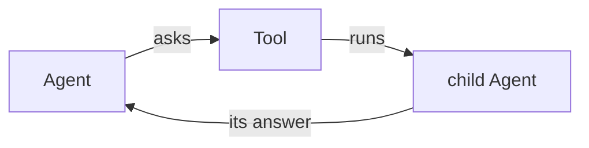

You will build a tool that runs a second agent. Give a small, cheap agent the
narrow half of a job and keep the big one for the rest.



```python run
import asyncio

from core import Agent, FakeModel, Message, ToolCall, tool


@tool
async def ask_helper(question: str) -> str:
    """Hand a question to a small agent and bring back its answer."""
    helper = Agent(FakeModel(["Paris."]))
    child = await helper.run(question)
    return child.messages[-1].text


ask = Message("assistant", "", [
    ToolCall("c1", "ask_helper", {"question": "What is the capital of France?"})])
parent = Agent(FakeModel([ask, "My helper says Paris."]), [ask_helper])

run = asyncio.run(parent.run("What is the capital of France?"))

print("the helper said:", [m.text for m in run.messages if m.role == "tool"][0])
print("the parent said:", run.messages[-1].text)
```

```text output
the helper said: Paris.
the parent said: My helper says Paris.
```

## How it works

- A tool is only a function, so it can build an `Agent` and await its `run`
  like any other code.
- The helper has its own conversation, model and step count, and the parent
  never sees inside it.
- Whatever the tool returns becomes the tool result the parent's model reads
  next.

## Variations

Give the helper a cheaper model and a `Steps` hook, so a child that runs away
cannot cost you much.
