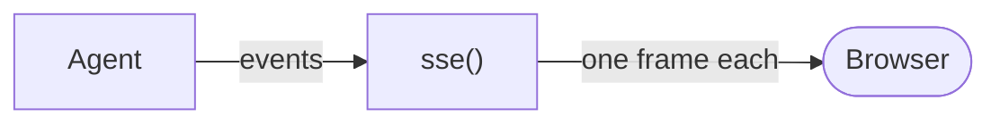

You will turn one run's events into the lines a browser reads. This is how you
put a live agent on a web page.



```python run
import asyncio
import json

from core import Agent, FakeModel
from drivers.transport import sse


async def main() -> None:
    agent = Agent(FakeModel(["Hello from the server."]))
    await agent.run("say hello", run_id="a")
    # sse() turns this run's events into the lines a browser reads.
    async for frame in sse(agent.events.stream(run_id="a")):
        head, body = frame.strip().split("\ndata: ")
        print(head, "->", json.loads(body)["name"])


asyncio.run(main())
```

```text output
id: 0 -> run.pre
id: 1 -> model.pre
id: 2 -> model.delta
id: 3 -> model.post
id: 4 -> run.post
```

## What happened

- `agent.events.stream(run_id="a")` gives you one run's events, replayed from
  the start and then live.
- The run had already finished here, so these five frames are the replay a
  browser gets when it reconnects.
- The `id:` line is the event number, and a browser hands it back to pick up
  after a drop.

## Change it

Hand `sse(...)` to your framework's streaming response and the same lines go
down the wire.
