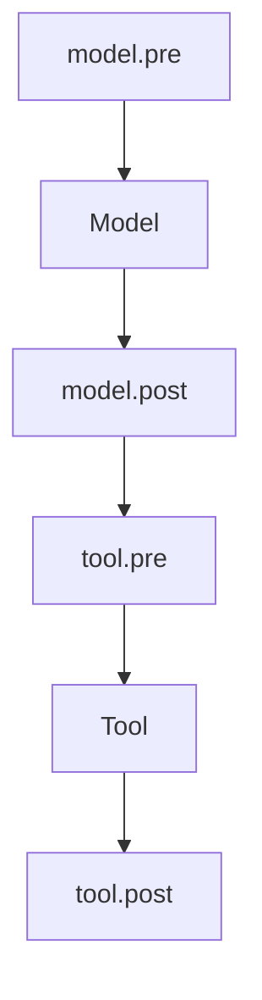

A hook is a rule your agent checks while it works. You write an async
function, tag it with the moments it should listen for, and attach it.
What it returns replaces what it was handed.



Those moments are called stages, and there are [eight of
them](/hooks/stages).

## Try it

This rule answers for `rm` instead of letting it run.

```python run
import asyncio

from core import Agent, FakeModel, Message, ToolCall, hook


@hook("tool.pre")
async def no_rm(call: ToolCall) -> str | None:
    """Answer for rm instead of letting it run."""
    if call.name == "rm":
        return "denied: ask a person first"
    return None


asked = Message("assistant", "", [ToolCall("c1", "rm", {"path": "/"})])
agent = Agent(FakeModel([asked, "ok, I will not"]))
agent.hooks.attach(no_rm)
run = asyncio.run(agent.run("delete everything"))
print(next(m.text for m in run.messages if m.role == "tool"))
print(run.messages[-1].text)
```

```text output
denied: ask a person first
ok, I will not
```

- `@hook("tool.pre")` only tags the function. `attach` is what makes the
  agent use it.
- A string returned from `tool.pre` skips the tool, and it is the answer the
  model reads next.
- That agent has no `rm` tool at all, and it did not matter. The rule
  answered before the toolbox was ever looked at.

## What a hook can return

- **Nothing.** Return `None` and what you were handed is left alone.
- **A new value of the same kind.** Hand back a `Message` where you were
  given a `Message`, and yours is what the run uses from here on.
- **Anything else** raises `ContractError`, naming your function, the stage,
  and what to return instead.

```text
stringly at model.post returned str; return Message, or None to leave it alone
```

## Ask for the run

A hook may take one argument more than its stage hands over, and that one is
the run.

```python
from core import Message, hook


@hook("model.pre")
async def trim(messages, run) -> list[Message]:
    """Keep the last twenty lines once the conversation gets long."""
    return messages[-20:] if run.step > 3 else messages
```

That shape is read once, when you attach the hook. A function that does not
fit its stage is refused right there. So is one that is not async.

## In what order they run

- First attached, first to run. `attach` hands back the hooks, so attaches
  chain, like `agent.hooks.attach(one).attach(two)`.
- `agent.hooks` is checked by every job. `run.hooks` belongs to one
  conversation only, and the agent's rules run first.
- At `tool.pre`, the first hook that answers ends it. The hooks behind it
  never hear about that call.

<Note>
  Your agent waits for every hook, so a slow one slows the whole job down.
  To watch without changing anything, read [events](/events/overview)
  instead.
</Note>

<CardGroup cols={2}>
  <Card title="The eight stages" icon="workflow" href="/hooks/stages">
    Every moment a hook can listen for, with an example each.
  </Card>
  <Card title="The four rules that come in the box" icon="sliders-horizontal" href="/hooks/cards">
    Steps, Budget, Permission and Log.
  </Card>
</CardGroup>
