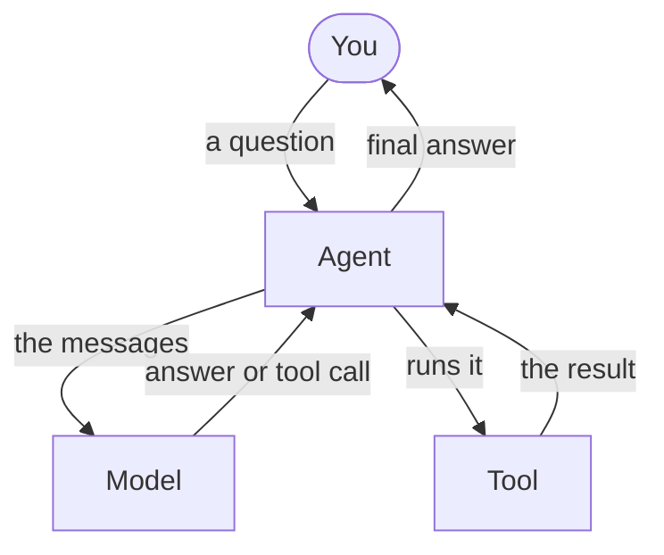

An AI agent is a program that talks to a model (like Claude or GPT), lets
the model use tools, and keeps going until the job is done. Stellar is the
small engine that runs this loop for you.



## What is in the box

Think of the agent as a robot with a backpack. Inside the backpack:

- **A brain.** The model. Claude, GPT, or one you write yourself.
- **Hands.** Tools. Any Python function can be a tool.
- **Rules.** Hooks. The robot checks them before and after each step.
  "Never delete files." "Stop after 8 steps."
- **A diary.** Events. Everything that happens is written down, as it
  happens. You can watch it live.

You build the robot once. Then you give it jobs. Each job is a `Run`. It has
its own conversation, its own step count, and its own id.

## Why people like it

- **Small.** The whole core is under 2000 lines of plain Python. You can
  read it in an afternoon.
- **No magic.** It uses the Python standard library and one HTTP client.
  That is all.
- **Easy to change.** Swap the model, add a tool, attach a rule. You can do
  it while the agent is running.
- **Works with any model.** Claude and OpenAI come in the box. Others take a
  few lines.

## Try it in ten seconds

This runs with no API key. `FakeModel` plays the part of the model and says
what you tell it to say.

```python run
import asyncio

from core import Agent, FakeModel

agent = Agent(FakeModel(["Hello! I am your agent."]))
run = asyncio.run(agent.run("Say hello"))
print(run.messages[-1].text)
```

```text output
Hello! I am your agent.
```

- `Agent(...)` builds the robot. It has a brain and nothing else.
- `agent.run("Say hello")` gives it a job. The answer comes back in `run`.
- `run.messages` is the whole conversation. The last message is the answer.

## Where to go next

<CardGroup cols={2}>
  <Card title="Quickstart" icon="rocket" href="/quickstart">
    Build your first agent with a real model, in five steps.
  </Card>
  <Card title="Examples" icon="play" href="/examples/hello">
    Twelve small programs you can copy, run, and change.
  </Card>
  <Card title="Tools" icon="wrench" href="/tools/functions">
    Turn a Python function into something the model can call.
  </Card>
  <Card title="Hooks" icon="shield" href="/hooks/overview">
    Add rules. Stop early, block a tool, trim the conversation.
  </Card>
</CardGroup>
