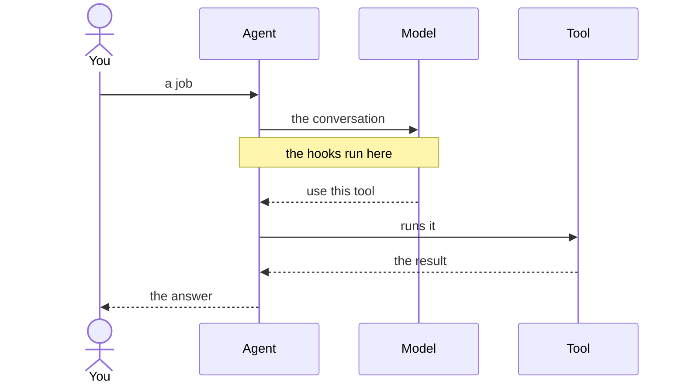

## Text

An agent is a robot with one backpack. Inside: a brain (`model`), a toolbox
(`tools`), a stack of rule cards (`hooks`), a radio (`events`) and one spare
pocket (`extra`). One errand is one `Run`: its own notebook, its own step
count, its own id, and **nothing of one run leaks into another**.

Everything is async, and *everything core calls takes the run*. This page is
the visual test: [it links to itself](/kitchen-sink), it says `asyncio.gather`
without meaning it, and it asks you to press <kbd>⌘</kbd><kbd>K</kbd> to
search. The standard library is the only thing core is built on, so
[the asyncio manual](https://docs.python.org/3/library/asyncio.html) is the
second book to keep open.

## Lists

- `Part`, `ToolCall`, `Message` — the data.
- `Model`, `Tool`, `Hooks` — the contracts.
  - A model writes an async `invoke(run)` and hands back a `Message`.
  - A tool writes an async `execute(run, ...)`; an async generator streams.
- `Agent`, `Run` — the bag and the errand.

1. The robot reads the whole backpack again.
2. The model answers, one `model.delta` per streamed `Part`.
3. Every tool it asked for runs.
   1. `tool.pre` may hand back a result, and the tool never runs.
   2. `tool.post` sees whatever came back.
4. Again, as long as the last answer asked for tools.

## Table

| noun | kind | the contract |
| --- | --- | --- |
| `Part` | data | one piece of a message: `type` names it, `data` holds it. |
| `Model` | contract | the brain. Write an async `invoke(run)`; hand back a `Message`. |
| `Tool` | contract | one thing the agent can do. Write an async `execute(run, ...)`. |
| `Stop` | signal | end the run cleanly. Raise it from any hook or tool. |

## Blockquote

> Small enough to read top to bottom in one sitting, strong enough for hard
> tasks when it is used well.

## Divider

---

## Image


## Code

{/* ==== code — task 02 edits below this line only ==== */}

```python title="main.py" {2,5-6}
import asyncio

from core import Agent, tool
from hooks.steps import Steps
from models.anthropic import Anthropic


@tool
def shout(word: str) -> str:
    """Shout a word."""
    return word.upper()


agent = Agent(Anthropic("claude-sonnet-5"), [shout])
agent.hooks.attach(Steps(8))                       # a runaway cap, on every run
asyncio.run(agent.run("shout hello"))
```

```bash
wc -l core/*.py
python3 docs/check.py
```

```json lines
{
  "model": "claude-sonnet-5",
  "max_tokens": 64000,
  "stream": true
}
```

```python hello.py
from core import Agent, FakeModel

agent = Agent(FakeModel(["hello"]))
run = await agent.run("say hello")
print(run.messages[-1].text)
```

```python expandable
import asyncio

from core import Agent, Message, Model, Stop, tool


class Echo(Model):
    """A brain that says back what it was told, once."""

    async def invoke(self, run) -> Message:
        return Message("assistant", run.messages[-1].text)


@tool
async def stop_after(word: str) -> str:
    """End the run cleanly when a word shows up."""
    if word == "enough":
        raise Stop("the tool said so")
    return word


async def main() -> None:
    agent = Agent(Echo(), [stop_after])
    runs = await asyncio.gather(*(agent.run(word) for word in ("one", "two")))
    for run in runs:
        print(run.id, run.step, run.messages[-1].text)


asyncio.run(main())
```

<CodeGroup>

```python title="agent.py"
from core import Agent
from models.anthropic import Anthropic

agent = Agent(Anthropic("claude-sonnet-5"))
```

```python title="fallback.py"
from core import Agent, Fallback
from models.anthropic import Anthropic
from models.openai import OpenAI

agent = Agent(Fallback(Anthropic("claude-sonnet-5"), OpenAI("gpt-5")))
```

</CodeGroup>

```text wrap
run.pre -> model.pre -> the model answers, a model.delta per streamed Part -> model.post -> the answer goes in the notebook -> tool.pre -> the tool runs, a tool.delta per yielded Part -> tool.post -> the result goes in the notebook -> again, as long as the last answer asked for tools -> run.post
```

```bash nocopy
export ANTHROPIC_API_KEY=...
export OPENAI_API_KEY=...
```

```python
from core import Fallback
from models.anthropic import Anthropic
from models.openai import OpenAI

agent.model = Anthropic("claude-sonnet-5")  # [!code --]
agent.model = Fallback(Anthropic("claude-sonnet-5"), OpenAI("gpt-5"))  # [!code ++]
```

## Components

{/* ==== components — task 03 edits below this line only ==== */}

<Note>Composition is by assignment: any part can be swapped, even mid-run.</Note>

<Tip>`check()` reads the whole backpack again at the top of every step, so a bad swap is caught before it runs.</Tip>

<Info>`from core import ...` also gives you `ProviderModel`, `FakeModel` and `Fallback`.</Info>

<Warning>
  There are no sync twins and no bridges: sync code is one `asyncio.to_thread`
  line you write inside the async method.

  Two code paths is two bugs, so core ships one — see [the loop](/concepts/loop).
</Warning>

<Check>Everything that happens goes out over the radio, in order, with a sequence number.</Check>

<Danger>A hook that raises anything but `Stop` ends the run with that error.</Danger>

<Callout icon="star" color="#D9A62E">Twelve nouns, and nothing else gets to be one.</Callout>

<CardGroup cols={3}>
  <Card title="The loop" icon="repeat" href="/kitchen-sink">
    Eight stages, in one order, on every step.
  </Card>
  <Card title="The nouns" icon="box" href="/kitchen-sink">
    Twelve of them, and nothing else.
  </Card>
  <Card title="The contracts" icon="plug" href="/kitchen-sink" arrow cta="Read the three">
    A Model, a Tool, a hook. That is the whole extension surface.
  </Card>
</CardGroup>

<Columns cols={2}>
  <Card title="Everything is async" icon="clock" href="https://docs.python.org/3/library/asyncio.html" horizontal>
    The second book to keep open. Opens in a new tab.
  </Card>
  <Card title="No link at all" icon="circle-slash">
    A card with no `href` is a plain box: nothing to click.
  </Card>
</Columns>

<AccordionGroup>
  <Accordion title="Why one backpack?" icon="backpack">
    The agent is the wiring, built once and shared; the run is the conversation.
  </Accordion>
  <Accordion title="Why no sync twins?" description="Asked more than once">
    Two code paths is two bugs. `asyncio.to_thread` is one line.
  </Accordion>
  <Accordion title="Why twelve nouns?" defaultOpen>
    Because the thirteenth would have to earn its place, and none has.
  </Accordion>
</AccordionGroup>

<Tabs>
  <Tab title="Anthropic" icon="sparkles">Blocks in, blocks out; a thinking block lands whole.</Tab>
  <Tab title="OpenAI" icon="bot">One user line carries the pictures a tool sent back.</Tab>
  <Tab title="Fake" icon="flask-conical">`FakeModel` answers from a list, with no key and no network.</Tab>
</Tabs>

<Steps>
  <Step title="Build the agent once">
    `Agent(model, tools)` is the wiring. Nothing about a conversation lives here.
  </Step>
  <Step title="Call run() per conversation" icon="play">
    A hundred users is one `asyncio.gather` line.
  </Step>
  <Step title="Read the notebook">
    `run.messages[-1].text` is the answer; `run.step` is how many turns it took.
  </Step>
  <Step title="Stop at eight, if you like" stepNumber={8}>
    `Steps(8)` buys eight replies, then raises `Stop` — the number is the card's, not the list's.
  </Step>
</Steps>

<Frame caption="The mark, at 72 pixels">
  
</Frame>

<Expandable title="the run's own arguments">
  <ParamField body="messages" type="list[Message]">
    The notebook to start from. The list you hand over is copied, never touched.
  </ParamField>
  <ParamField body="run_id" type="str">
    Names the run, which is how a stream finds it and how a resume keeps its identity.
  </ParamField>
</Expandable>

<ParamField path="model" type="Model" required>
  The brain. One `invoke(run)`, one `Message` back.
</ParamField>

<ParamField query="tools" type="list[Tool]" default="[]">
  The toolbox. A `@tool` function counts.
</ParamField>

<ParamField header="x-api-key" type="str" deprecated>
  Read from the environment unless you pass `api_key=`.
</ParamField>

<ResponseField name="messages" type="list[Message]" required>
  The whole conversation, in order.
</ResponseField>

<ResponseField name="step" type="int" default="0">
  How many turns the errand took.
</ResponseField>

A <Tooltip tip="one piece of a message: type names it, data holds it">Part</Tooltip> is
the smallest thing on the wire, and <Icon icon="radio" size={16} color="#D9A62E" /> is
the radio every one of them goes out on.

## Diagram

A `mermaid` fence is a picture, not a code block. Two kinds are drawn: a
`flowchart`, which [the introduction](/introduction) has, and a
`sequenceDiagram`, which is this.


