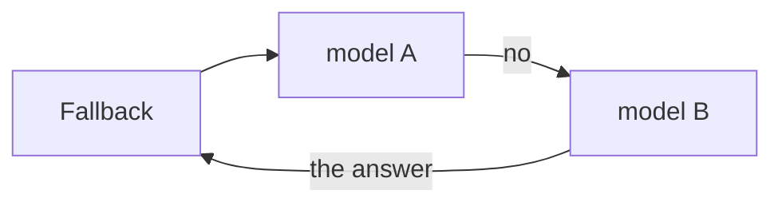

Give `Fallback` a list of models. It asks the first one. If that one says no,
it asks the next.



`Fallback` is itself a [model](/models/overview), so it can mix vendors. The
conversation is stellar's own shape, and every provider builds its request
from that.

## What counts as a no

Two things move the run along.

- `Unsupported`, which is the [profile check](/models/profiles) saying no.
  Nothing was sent, so it costs nothing.
- `ProviderError`, which is the provider saying no after its three tries.

Everything else raises instead. A wiring mistake is not a reason to go and ask
somebody else, and moving on would hide the bug.

The last model is asked outside the loop. Whatever it raises reaches you
unchanged.

## Try it

The first model always refuses. The second one answers.

```python run
import asyncio

from core import Agent, FakeModel, Fallback, Model, Unsupported


class Picky(Model):
    async def invoke(self, run):
        raise Unsupported("Picky cannot read pictures")


agent = Agent(Fallback(Picky(), FakeModel(["I can answer that."])))
agent.events.listen(lambda event: print(event.source, "said no:", event.data),
                    "model.skip")

run = asyncio.run(agent.run("what is in this picture?"))
print(run.messages[-1].text)
```

```text output
model:Picky said no: Picky cannot read pictures
I can answer that.
```

- Every skip goes out as a `model.skip` [event](/events/overview).
- The source is `model:` plus the model id, or the class name when there is no
  id.
- The winning [`Message`](/reference/types) carries `meta["model"]`, the name
  of who answered.

## Write your own rule

A smarter rule is just a model of your own. This one uses the small model
until the conversation gets long.

```python run
import asyncio

from core import Agent, FakeModel, Fallback, Model


class Cheap(Model):
    def __init__(self, small, big):
        self.small, self.big = small, big

    async def invoke(self, run):
        long = sum(len(m.text) for m in run.messages) > 20_000
        return await (self.big if long else self.small).invoke(run)


picker = Cheap(FakeModel(["The small model answered."]),
               FakeModel(["The big model answered."]))
agent = Agent(Fallback(picker, FakeModel(["Nobody asked me."])))

print(asyncio.run(agent.run("hi")).messages[-1].text)
```

```text output
The small model answered.
```

`Cheap` never touches the network, so it raises neither of the two. Whatever
the model it picked raises is what the `Fallback` around it sees.

## Limits

- A provider that is down is retried in full, three times, at every step
  before the next one is asked. Add a cooldown of your own when that hurts.
- A model whose live reply dies halfway falls through like any other no. The
  conversation comes out right, but a live view already showed the dead
  model's words.
