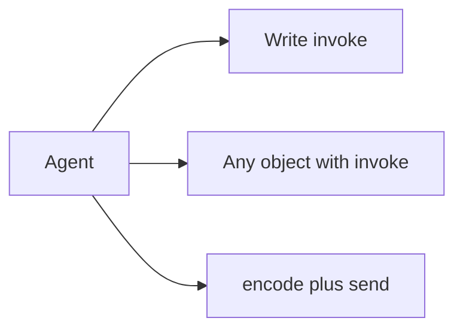

The model is the brain of your [agent](/reference/agent). It reads the
conversation and writes back one reply. There are three ways to plug one in.



All three end up doing the same job. Pick the smallest one that fits.

## Subclass `Model`

Subclass `Model` and write one method. It is handed the `Run`, and it gives
back one assistant [`Message`](/reference/types). The conversation so far is
`run.messages`.

```python run
import asyncio

from core import Agent, Message, Model


class Shouty(Model):
    async def invoke(self, run) -> Message:
        return Message("assistant", run.messages[-1].text.upper())


run = asyncio.run(Agent(Shouty()).run("hello"))
print(run.messages[-1].text)
```

```text output
HELLO
```

- `run.messages[-1]` is the newest message, and `.text` is its words.
- The reply is one `Message` with the role `assistant`.
- `invoke` has to be `async`. Wrap a blocking library in `asyncio.to_thread`.

## Duck-typed models

There is no base class you must inherit. Any object whose own class writes an
async `invoke` passes the [check](/concepts/contracts) and runs.

```python run
import asyncio

from core import Agent, Message


class Parrot:
    async def invoke(self, run) -> Message:
        return Message("assistant", "you said: " + run.messages[-1].text)


run = asyncio.run(Agent(Parrot()).run("hello"))
print(run.messages[-1].text)
```

```text output
you said: hello
```

## `ProviderModel`: `encode` and `send`

Real models answer over HTTP. Subclass `ProviderModel` and write two small
methods instead of one big one. `encode` builds the request. `send` makes the
call and hands the reply back in pieces.

```python run
import asyncio

from core import Agent, Part, ProviderModel


class TwoPieces(ProviderModel):
    def encode(self, run):
        return {"say": run.messages[-1].text}

    async def send(self, run, body):
        yield Part("text", "Hello ")
        yield Part("text", body["say"] + "!")


run = asyncio.run(Agent(TwoPieces()).run("world"))
print(run.messages[-1].text)
```

```text output
Hello world!
```

Stellar joins the pieces into one message for you. So you write a live view
once, and it works with every model.

<CardGroup cols={2}>
  <Card title="Custom providers" icon="plug" href="/models/provider">
    What `encode` and `send` each do, and what a piece may be.
  </Card>
  <Card title="Provider internals" icon="folder" href="/models/folder">
    The two files a real provider is made of.
  </Card>
  <Card title="Profiles and capabilities" icon="sliders-horizontal" href="/models/profiles">
    A short list per model, checked before anything is sent.
  </Card>
  <Card title="Anthropic" icon="sparkles" href="/models/anthropic">
    Claude, and the four models that come in the box.
  </Card>
  <Card title="OpenAI and compatible APIs" icon="bot" href="/models/openai">
    GPT, plus the vendors that copied its API.
  </Card>
  <Card title="Fallback and routing" icon="shuffle" href="/models/fallback">
    A list of models. The first one that answers wins.
  </Card>
  <Card title="Testing providers" icon="flask-conical" href="/models/testing">
    Canned replies, `check_model`, and `FakeModel`.
  </Card>
</CardGroup>
