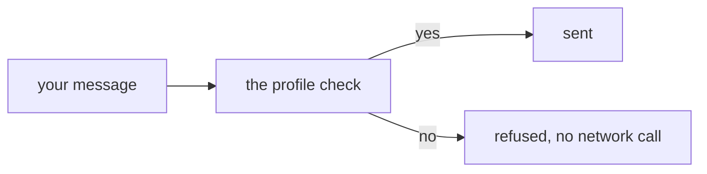

A `Profile` is one short list per model. It says how big the input may be, and
how much the model may write back. It also says which kinds of thing the model
can read.



Every [provider](/models/folder) you build carries exactly one profile, picked
by the model id you named. You ask a profile one question, and it looks like
`"image" in model.profile`.

## Capability flags

| word | what it means |
| --- | --- |
| `image` | you may send a picture |
| `document` | you may send a PDF |
| `thinking` | you may send a thinking part back |
| `tools` | your toolbox may go along with the request |
| `stream` | ask for the live stream instead of one plain reply |
| `tool_stream` | put tool arguments on the [event log](/events/streaming) as they arrive |
| `json` | the model can be asked for structured output |
| `system` | the model reads system messages |

The first three name a kind of part. The next three are read by the two
providers in the box. Nothing here reads `json` or `system` yet. They are
there for a model picker of your own to ask about.

## The capability rule

A word that names a kind of part means you may send that part. Only what you
wrote is checked, because the model's own past replies go back to it as they
came.

## Example

This profile has no `image` word, so the picture never leaves your computer.

```python run
import asyncio

from core import Agent, Message, Part, Profile, Unsupported
from models.openai import OpenAI

TEXT_ONLY = Profile("gpt-5.6-luna", 1_050_000, 128_000, frozenset({"system", "tools"}))
agent = Agent(OpenAI("gpt-5.6-luna", api_key="not-used", profile=TEXT_ONLY))

picture = Message("user", [Part("image", {"url": "https://example.com/cat.png"})])
try:
    asyncio.run(agent.run(picture))
except Unsupported as no:
    print(no)
```

```text output
gpt-5.6-luna reads no 'image' part; it reads system, tools
```

- The check runs first, so nothing was sent and nothing was paid for.
- `Unsupported` is a `ValueError`. It names the part and lists what does work.
- Under a [fallback](/models/fallback), that free no moves you to the next
  model.

## Notes

- Three kinds are never checked, because stellar handles them itself. They are
  `text`, `tool_call` and `meta`.
- A toolbox on a model with no `tools` word is refused the same way.
- An id you did not list takes the longest one it starts with, so
  `gpt-5.6-luna-2026-08-01` finds the `gpt-5.6-luna` row.
- An id that matches nothing gets a generous default and a warning in the log.
  It still runs.
- `profile=` overrules all of it for one model.
