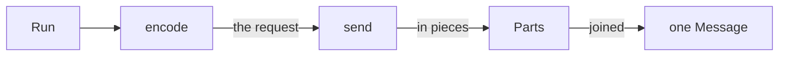

`ProviderModel` cuts a model in half. One half builds the request and touches
nothing. The other half makes the network call.



## What each half does

`encode(run)` reads `run.messages` and `run.agent.tools` and returns the
request body. It sends nothing. That is why a test can check it with no
network at all.

`send(run, body)` is handed exactly what `encode` built, and never builds it
again. Everything that can go wrong on a network belongs in here.

You do not write `invoke`. Stellar calls both methods, runs the
[hooks](/hooks/stages) on every piece, and joins the pieces into one assistant
[`Message`](/reference/types).

## What a piece may be

`send` yields `Part` objects. Five rules cover every one of them.

- **`Part("text", "...")` is a piece of the answer.** Text pieces in a row are
  glued together.
- **`Part("tool_call", ToolCall(...))` arrives whole.** Buffer the arguments
  yourself. Stellar never sees half of one.
- **`Part("meta", {...})` merges into `message.meta`.** Send one at the end,
  not several halves.
- **Arguments that are not valid JSON do not raise.** They become an empty
  call plus `meta["invalid_args"]`. The tool result tells the model what it
  typed, so it can fix it.
- **Any other type is kept as it is.** Thinking blocks and vendor extras ride
  through untouched.

Three things are always written the same way, so providers agree with each
other. A picture is always `Part("image", ...)`. `meta["usage"]` holds
`input_tokens` and `output_tokens`, which the [budget hook](/hooks/cards)
reads.

`meta["model"]` names who answered. That is how you tell who won a
[fallback](/models/fallback).

## Try it

This provider hands back three pieces. The listener counts them as they
arrive.

```python run
import asyncio

from core import Agent, Part, ProviderModel


class Slowly(ProviderModel):
    def encode(self, run):
        return None

    async def send(self, run, body):
        for piece in ("A ", "small ", "answer."):
            yield Part("text", piece)


agent = Agent(Slowly())
pieces = []
agent.events.listen(lambda event: pieces.append(event.data), "model.delta")

run = asyncio.run(agent.run("say something"))
print(run.messages[-1].text)
print(len(pieces), "pieces")
```

```text output
A small answer.
3 pieces
```

- The answer is one message, even though it came in three pieces.
- Each piece went out as a `model.delta` event too, in order.
- A new vendor feature is a new piece type, never a new method.

Read [inside a provider](/models/folder) next. Then
[what a model can do](/models/profiles).
