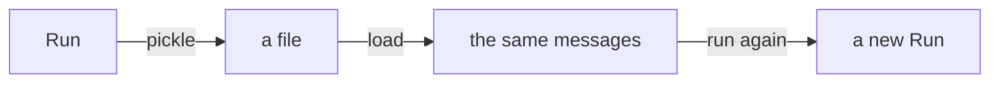

A conversation does not have to finish today. A [`Run`](/reference/agent)
saves down to a few plain values, and `agent.run` picks it back up. Think of
it as a save point in a game.



What gets saved:

- `id`, the name of the conversation
- `messages`, the conversation itself
- `step`, how many turns it took
- `extra`, a dict for anything else you want to keep

What does not: the agent, its hooks and its event log. Those are code you
build again at start-up, and a save file has no business holding your program.

## Try it

```python run
import asyncio
import pickle

from core import Agent, FakeModel


async def main() -> None:
    agent = Agent(FakeModel(["Blue.", "You asked about my favourite colour."]))
    first = await agent.run("What is your favourite colour?")
    print(first.messages[-1].text)

    saved = pickle.loads(pickle.dumps(first))      # four values, no agent
    later = await agent.run("What did I ask?",
                            messages=saved.messages, run_id=saved.id)
    print(later.messages[-1].text)
    print(len(later.messages), "messages, same id:", later.id == first.id)


asyncio.run(main())
```

```text output
Blue.
You asked about my favourite colour.
4 messages, same id: True
```

- `messages=` starts from the saved conversation. It is copied, so your list
  is left alone, and the new prompt goes on the end.
- `run_id=` keeps the same name, so anyone
  [watching that id](/events/streaming) sees one conversation across the gap.

<Note>
  What `pickle.loads` gives you is a save file, not a working run. It has no
  `agent` and no `hooks`, and reading either one raises `AttributeError`. Read
  its values, hand them to `agent.run`, and use the `Run` you get back.
</Note>

## What starts empty again

`agent.run` always builds a brand new `Run`. The messages and the id come
across, but the step count starts at 0 and `extra` starts empty. So a
[`Steps`](/hooks/cards) limit and a `Budget` total both begin again. Putting
them back is one hook.

```python
from core import hook


@hook("run.pre")
async def seed(message, run) -> None:
    run.extra.update(saved.extra)
```

## Saving it as JSON

For a database column, or any other process, take each message apart with
`dataclasses.asdict`. Building it back is yours, and there is only one shape
to know. `content` is always a list of parts, and `tool_calls` a list of
calls.

```python run
import asyncio
import json
from dataclasses import asdict

from core import Agent, FakeModel, Message, Part, ToolCall


def revive(d: dict) -> Message:
    """One dict back into one Message, its parts and calls included."""
    return Message(**{**d,
                      "content": [Part(**p) for p in d["content"]],
                      "tool_calls": [ToolCall(**c) for c in d["tool_calls"]]})


job = asyncio.run(Agent(FakeModel(["Blue."])).run("Favourite colour?"))
text = json.dumps([asdict(m) for m in job.messages])
back = [revive(d) for d in json.loads(text)]
print([m.text for m in back])
```

```text output
['Favourite colour?', 'Blue.']
```

That handles a whole conversation, tool calls and `meta` included. A part's
`data` is a string unless a model adapter put something else there. If it did,
saving that something is yours.

<Warning>
  Put only data in `extra`. A live thing will not exist when you load the file
  back. The channel `Permission(ask=True)` uses to ask a person is one of
  those. Build them again at start-up.
</Warning>
