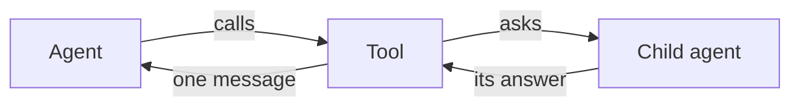

Sometimes one agent should hand a job to another. There is no special class
for this, and none is needed. A [tool](/tools/classes) can build an agent and
ask it a question, just like you would.



## Try it

The loop hands every tool the `run` first. `run.agent` is the agent that
called it, so `run.agent.model` is the model the helper can borrow.

```python run
import asyncio

from core import Agent, FakeModel, Message, Tool, ToolCall


class Research(Tool):
    name = "research"
    description = "Ask a helper agent one question."
    parameters = {"type": "object", "properties": {"question": {"type": "string"}}}

    async def execute(self, run, question) -> str:
        helper = Agent(run.agent.model)        # same model, own conversation
        return (await helper.run(question)).messages[-1].text


agent = Agent(FakeModel([
    Message("assistant", "",
            [ToolCall("c1", "research", {"question": "France?"})]),
    "Paris.",                                  # the helper's turn
    "The helper says Paris.",                  # the parent's turn
]), [Research()])

job = asyncio.run(agent.run("Ask a helper about France."))
for message in job.messages[2:]:               # skip the question and the call
    print(message.role, "|", message.text)
```

```text output
tool | Paris.
assistant | The helper says Paris.
```

- The helper's answer comes back as one ordinary tool message. That is the
  only thing that crosses over.
- The helper starts with an empty conversation and its own event log. The
  parent's listeners never hear the helper think.
- [`FakeModel`](/models/testing) reads one script, so here the parent and the
  helper take turns from the same list. A real model has no script and no such
  ordering.

## Give the helper less

Sharing the model is a choice, and so is everything else. Hand the helper a
smaller toolbox and its own limit, on purpose.

```python
helper = Agent(run.agent.model, [Search()])   # fewer tools than the parent
helper.hooks.attach(Steps(3))                 # and its own limit
```

A helper with no tools at all is the cheapest one there is. It cannot call
anything, so all it can do is answer.

<Warning>
  Nothing stops you from giving the helper the parent's whole toolbox,
  including the tool that made it. Then it can call itself, forever. Give it a
  smaller box, a [`Steps`](/hooks/cards) limit, or both.
</Warning>

## Good to know

- Nothing about the helper is counted by the parent. A budget hook on the
  parent never sees what the helper spent.
- Write `execute` as an async generator and the helper's answer arrives piece
  by piece, as it is typed. See [tool classes](/tools/classes).

<CardGroup cols={2}>
  <Card title="Save a run" icon="clock" href="/patterns/checkpoint">
    Stop in the middle, and pick the same conversation up tomorrow.
  </Card>
  <Card title="Many jobs at once" icon="shuffle" href="/patterns/concurrency">
    One agent, a hundred conversations, no locks.
  </Card>
</CardGroup>
