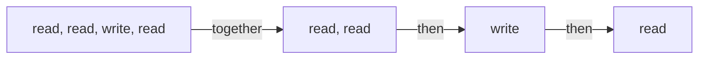

A model can ask for several tools in one turn. Whether they actually run at
the same time is one keyword on each tool, and nothing else.



## The rule

Tools marked `parallel=True` that sit next to each other run together. Any
other tool runs on its own. Everything before it finishes first, then it
runs, then the next batch starts.

```python
from core import tool


@tool(parallel=True)                     # may run beside its neighbours
def read(path: str) -> str:
    """Read a file."""
    return path.upper()
```

On a [class](/tools/classes), write `parallel = True` beside the name.
Nothing runs together until you say so, which is the safe default.

## Inside one batch

- Every `tool.pre` hook runs first, in the order the model asked. A refusal
  skips that one call and leaves its neighbours alone.
- The calls then run at once, in one `asyncio.gather`.
- The answers are written down in the order the model asked for them,
  whichever tool finished first. The conversation reads the same every time.

## Try it

Two tools that each wait a fifth of a second. Run together they take one
wait, not two.

```python run
import asyncio
import time

from core import Agent, FakeModel, Message, ToolCall, tool


@tool(parallel=True)
async def read(path: str) -> str:
    """Read a file."""
    await asyncio.sleep(0.2)
    return f"read {path}"


@tool(parallel=True)
async def look(path: str) -> str:
    """Look something up."""
    await asyncio.sleep(0.2)
    return f"looked at {path}"


asked = Message("assistant", "", [ToolCall("c1", "read", {"path": "a"}),
                                  ToolCall("c2", "look", {"path": "b"})])
agent = Agent(FakeModel([asked, "done"]), [read, look])
start = time.perf_counter()
run = asyncio.run(agent.run("go"))
took = time.perf_counter() - start

for message in run.messages:
    if message.role == "tool":
        print(message.text)
print("both finished in one wait" if took < 0.35 else "one after the other")
```

```text output
read a
looked at b
both finished in one wait
```

## When something stops the run

A `Stop` or a `ContractError` from one tool waits until the whole batch has
finished. It is then raised, taking the first one in call order, so nothing
is cancelled halfway through a write. Every other error becomes that call's
result, and the tools beside it carry on untouched.

<Note>
  The batches are cut from the names the model asked for, before any hook
  runs. A `tool.pre` hook that swaps in a different tool does not change the
  batch its call landed in.
</Note>

## Limits

- A slow tool holds up the `Stop`. The signal waits for the whole batch, so
  it is only as quick as the slowest member.
- There is no cap on how many run at once. A turn asking for fifty parallel
  calls runs fifty at once.

<CardGroup cols={2}>
  <Card title="What a tool can return" icon="book-open" href="/tools/results">
    Text, a dict, a picture, or nothing at all.
  </Card>
  <Card title="Stop a run, skip a tool" icon="circle-slash" href="/hooks/stopping">
    The two signals, and what the loop catches.
  </Card>
</CardGroup>
